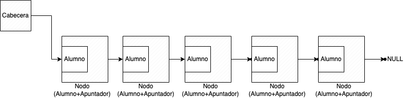
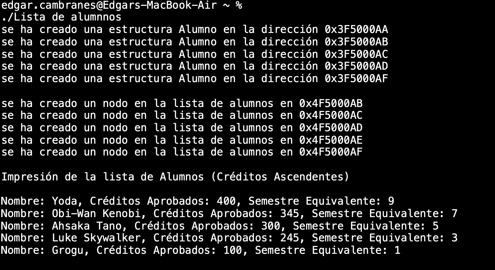
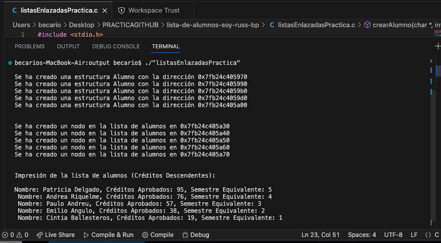

[](https://classroom.github.com/a/4TBp-IWb)
[](https://classroom.github.com/online_ide?assignment_repo_id=11625178&assignment_repo_type=AssignmentRepo)
# Ejercicio de Práctica-PD
#  Lista de Alumnos.
**Nota: las [evidencias](https://github.com/uadyfmat/lista-de-alumnos-soy-russ-bp/tree/master#evidencias) del funcionamiento de mi código, así como el link que dirige hacia él se encuentran al final de este readme**


## Instrucciones:

Considera la siguiente Estructura de Datos **Alumno** que contiene los datos:
```c++
     - Nombre Completo (cadena),  
     - Créditos Aprobados( int),
     - Semestre equivalente (int).
 ```


<p align="center">
  
</p>

 
Se creará una lista (simplemente enlazada) para mantener la información de los alumnos.  Cada nodo de la lista ***contiene*** en el dato una estructura Alumno y un apuntador al siguiente nodo.

La lista simplemente enlazada y la estructura Alumno se deben crear en memoria dinámica. 



La funcionalidad que se implementará para la lista es la siguiente:

```c++
//Prototipos de las funciones
    *Alumno crearAlumno(*char, int, int);
    void imprimirAlumno();

    
    *Nodo crearNodo(*Alumno);
    int insertarNodoOrdenadoCréditos(*nodo);
    void imprimirLista();
```
El programa puede implementarse en C o C++. Puede utilizar estructuras y funciones por separado o definidas dentro de la estructura.

Se debe incluir una sección main que incluya los llamados correspondientes a funciones para realizar las siguientes acciones:

```c++
    int main(){
    //crear 5 instancias de estructuras Alumno
    //crear la lista con las 5 instancias de Alumno
    //insertar de forma ordenada de acuerdo al número de créditos (descendente)
    //imprimir la lista
    }
```

No se espera que la funcionalidad este completa durante la sesión pero es requisito realizar un commit/push al repo de la tarea ANTES del final de la sesión. Puedes completar la funcionalidad hasta antes del deadline indicado en el assignment.

> :pushpin: **Importante:**    
> Incluir en el repo evidencia (imagen, video) de la ejecución en la terminal que muestre el correcto funcionamiento de la implementación. La evidencia se incluye como un  ejemplo y la ejecución se espera lo más similar posible.
>La implementación que se solicita es la mínima indispensable, pero pueden agregar más funciones si así lo requieren. Lo relevante es cuidar el principio de ***responsabilidad única***.



---------------------------------------------------------------------------------------------------------------------------------------------------------------
## Evidencias:
Evidencia del funcionamiento de mi consola de comandos:

<p align="center">
  
</p>

El formato es exactamente el mismo al del ejemplo, los cambios se reflejan en el nombre de los alumnos, los créditos aprobados y los semestres equivalentes.

En mi código puede ver cada parte que hizo posible esta ejecución, cada función contiene el principio de ***responsabilidad única***.
Puede ver el código [aquí](https://github.com/uadyfmat/lista-de-alumnos-soy-russ-bp/blob/22782fbffd785ba01cd7f09b0ef8a6eafecca5c7/listasEnlazadasPractica.c)

> Written with [StackEdit](https://stackedit.io/).
